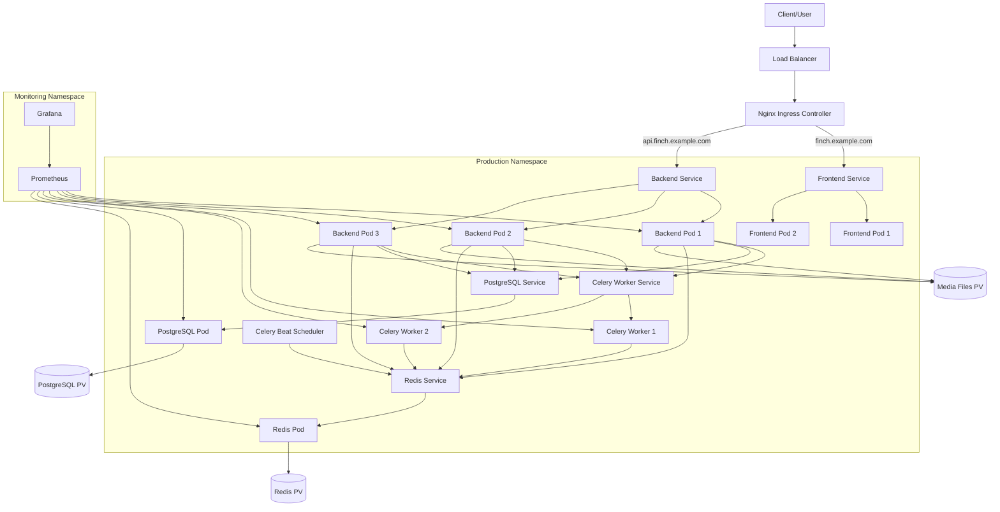

# Kubernetes Architecture Documentation

## Overview

This document describes the comprehensive Kubernetes architecture designed for the Finch application, including detailed explanations of deployments, services, ingress configuration, and resource allocation strategies.

## Architecture Diagram



## Namespace Organization

### Production Namespace (`finch-production`)
- **Purpose**: Main production environment
- **Components**: All application services, databases, and caches
- **Resource Quotas**: High memory and CPU allocations
- **Network Policies**: Restricted inter-namespace communication

### Staging Namespace (`finch-staging`)
- **Purpose**: Pre-production testing environment
- **Components**: Identical to production but with reduced resources
- **Access Control**: Basic authentication for security
- **Data**: Sanitized production data copies

### Monitoring Namespace (`finch-monitoring`)
- **Purpose**: Centralized monitoring and observability
- **Components**: Prometheus, Grafana, AlertManager
- **Access**: Cluster-wide metrics collection permissions

## Component Specifications

### Frontend Deployment (Vue.js)

#### Resource Allocation:
```yaml
resources:
  requests:
    memory: "128Mi"
    cpu: "100m"
  limits:
    memory: "256Mi"
    cpu: "200m"
```

#### Scaling Strategy:
- **Replicas**: 2 (production), 1 (staging)
- **Strategy**: Rolling update with zero downtime
- **Auto-scaling**: HPA based on CPU (70% threshold)

#### Features:
- **Static Asset Serving**: Nginx with optimized caching
- **Health Checks**: `/health` endpoint monitoring
- **Security**: Non-root user, read-only filesystem
- **Configuration**: Runtime environment variables

### Backend Deployment (Django)

#### Resource Allocation:
```yaml
resources:
  requests:
    memory: "512Mi"
    cpu: "250m"
  limits:
    memory: "1Gi"
    cpu: "500m"
```

#### Scaling Strategy:
- **Replicas**: 3 (production), 1 (staging)
- **Strategy**: Rolling update with 1 max unavailable
- **Auto-scaling**: HPA based on memory (80% threshold)

#### Features:
- **WSGI Server**: Gunicorn with multiple workers
- **Database Migrations**: Automated via init containers
- **Static Files**: Automatic collection and serving
- **Health Checks**: Django health endpoint
- **Security**: Non-root user, restricted capabilities

### Database Deployment (PostgreSQL)

#### Resource Allocation:
```yaml
resources:
  requests:
    memory: "256Mi"
    cpu: "250m"
  limits:
    memory: "1Gi"
    cpu: "500m"
```

#### Storage:
- **Volume**: 20Gi (production), 10Gi (staging)
- **Storage Class**: `fast-ssd` for performance
- **Backup Strategy**: Automated daily backups to object storage

#### Features:
- **High Availability**: Single instance with planned HA upgrade
- **Performance Tuning**: Optimized postgresql.conf
- **Security**: Password authentication, network policies
- **Monitoring**: Connection and query metrics

### Cache Deployment (Redis)

#### Resource Allocation:
```yaml
resources:
  requests:
    memory: "128Mi"
    cpu: "100m"
  limits:
    memory: "512Mi"
    cpu: "250m"
```

#### Configuration:
- **Memory Policy**: `allkeys-lru` for efficient caching
- **Persistence**: AOF enabled for data durability
- **Security**: Password authentication required

### Worker Deployment (Celery)

#### Resource Allocation:
```yaml
resources:
  requests:
    memory: "256Mi"
    cpu: "200m"
  limits:
    memory: "512Mi"
    cpu: "400m"
```

#### Scaling:
- **Replicas**: 2 (production), 1 (staging)
- **Concurrency**: 4 workers per pod
- **Queue Management**: Redis-based task distribution

## Ingress Configuration

### SSL/TLS Termination:
- **Certificate Manager**: Let's Encrypt integration
- **SSL Redirect**: Enforced HTTPS
- **HSTS**: HTTP Strict Transport Security headers

### Load Balancing:
- **Algorithm**: Least connections
- **Health Checks**: Backend service monitoring
- **Failover**: Automatic unhealthy pod removal

### Security Features:
- **Rate Limiting**: 100 requests/minute per IP
- **CORS**: Configured for cross-origin requests
- **WAF**: Web Application Firewall rules
- **DDoS Protection**: Built-in mitigation

## Persistent Storage Strategy

### Volume Types:

#### Database Storage:
- **Type**: SSD-backed persistent volumes
- **Size**: 20Gi (production), 10Gi (staging)
- **Backup**: Daily automated snapshots
- **Retention**: 30 days for production, 7 days for staging

#### Media Files:
- **Type**: Network-attached storage
- **Size**: 50Gi (production), 10Gi (staging)
- **Access Mode**: ReadWriteMany for multi-pod access
- **CDN Integration**: CloudFront for global distribution

#### Cache Storage:
- **Type**: SSD-backed for performance
- **Size**: 5Gi (production), 2Gi (staging)
- **Persistence**: Enabled for data durability

### Backup Strategy:
```yaml
# Backup CronJob example
apiVersion: batch/v1
kind: CronJob
metadata:
  name: postgres-backup
spec:
  schedule: "0 2 * * *"  # Daily at 2 AM
  jobTemplate:
    spec:
      template:
        spec:
          containers:
          - name: postgres-backup
            image: postgres:15-alpine
            command:
            - /bin/bash
            - -c
            - pg_dump $DATABASE_URL | gzip > /backup/backup-$(date +%Y%m%d).sql.gz
```

## Network Policies

### Ingress Rules:
```yaml
# Allow frontend to backend communication
apiVersion: networking.k8s.io/v1
kind: NetworkPolicy
metadata:
  name: frontend-to-backend
spec:
  podSelector:
    matchLabels:
      app: finch-backend
  policyTypes:
  - Ingress
  ingress:
  - from:
    - podSelector:
        matchLabels:
          app: finch-frontend
```

### Security Isolation:
- **Default Deny**: All traffic blocked by default
- **Explicit Allow**: Only required connections permitted
- **Namespace Isolation**: Cross-namespace communication restricted

## Monitoring and Observability

### Metrics Collection:
- **Prometheus**: Cluster and application metrics
- **Node Exporter**: System-level metrics
- **Application Metrics**: Custom Django and Vue.js metrics

### Logging Strategy:
- **Centralized Logging**: ELK stack or similar
- **Log Aggregation**: Fluentd or Fluent Bit
- **Log Retention**: 30 days for production, 7 days for staging

### Alerting Rules:
```yaml
# Example alerting rule
groups:
- name: finch-app
  rules:
  - alert: HighErrorRate
    expr: rate(http_requests_total{status=~"5.."}[5m]) > 0.1
    for: 2m
    labels:
      severity: critical
    annotations:
      summary: "High error rate detected"
```

## Security Measures

### Pod Security Standards:
- **Security Contexts**: Non-root users enforced
- **Capabilities**: Minimal required capabilities only
- **Filesystem**: Read-only root filesystem where possible

### Secrets Management:
- **Encryption**: etcd encryption at rest
- **Rotation**: Automated secret rotation
- **Access Control**: RBAC for secret access

### Network Security:
- **Network Policies**: Micro-segmentation implemented
- **Service Mesh**: Istio for advanced traffic management (optional)
- **mTLS**: Mutual TLS for service-to-service communication

## Deployment Procedures

### Initial Deployment:
```bash
# Create namespaces
kubectl apply -f kubernetes/namespace.yaml

# Create secrets (see Phase 4)
kubectl apply -f kubernetes/secrets/

# Deploy storage
kubectl apply -f kubernetes/persistent-volumes.yaml
kubectl apply -f kubernetes/persistent-volume-claims.yaml

# Deploy databases
kubectl apply -f kubernetes/postgresql-deployment.yaml
kubectl apply -f kubernetes/redis-deployment.yaml

# Deploy applications
kubectl apply -f kubernetes/backend-deployment.yaml
kubectl apply -f kubernetes/frontend-deployment.yaml
kubectl apply -f kubernetes/celery-deployment.yaml

# Configure ingress
kubectl apply -f kubernetes/ingress.yaml
```

### Rolling Updates:
```bash
# Update backend image
kubectl set image deployment/finch-backend \
  finch-backend=roy35/finch-backend:v1.2.3 \
  -n finch-production

# Monitor rollout
kubectl rollout status deployment/finch-backend -n finch-production
```

### Rollback Procedures:
```bash
# Rollback to previous version
kubectl rollout undo deployment/finch-backend -n finch-production

# Rollback to specific revision
kubectl rollout undo deployment/finch-backend \
  --to-revision=2 -n finch-production
```

## Scaling Strategies

### Horizontal Pod Autoscaler (HPA):
```yaml
apiVersion: autoscaling/v2
kind: HorizontalPodAutoscaler
metadata:
  name: finch-backend-hpa
spec:
  scaleTargetRef:
    apiVersion: apps/v1
    kind: Deployment
    name: finch-backend
  minReplicas: 3
  maxReplicas: 10
  metrics:
  - type: Resource
    resource:
      name: cpu
      target:
        type: Utilization
        averageUtilization: 70
  - type: Resource
    resource:
      name: memory
      target:
        type: Utilization
        averageUtilization: 80
```

### Vertical Pod Autoscaler (VPA):
```yaml
apiVersion: autoscaling.k8s.io/v1
kind: VerticalPodAutoscaler
metadata:
  name: finch-backend-vpa
spec:
  targetRef:
    apiVersion: apps/v1
    kind: Deployment
    name: finch-backend
  updatePolicy:
    updateMode: "Auto"
```

### Cluster Autoscaler:
- **Node Scaling**: Automatic node provisioning
- **Cost Optimization**: Spot instances for development
- **Resource Efficiency**: Bin packing optimization

## Disaster Recovery

### Backup Strategy:
- **Database Backups**: Daily automated backups
- **Configuration Backups**: GitOps repository
- **Disaster Recovery Site**: Multi-region deployment

### Recovery Procedures:
1. **Database Recovery**: Point-in-time recovery from backups
2. **Application Recovery**: Redeploy from known good images
3. **Data Recovery**: Restore from object storage backups

### RTO/RPO Targets:
- **RTO**: 30 minutes for critical services
- **RPO**: 1 hour maximum data loss
- **Testing**: Monthly DR drills

## Performance Optimization

### Resource Optimization:
- **Right-sizing**: Regular resource usage analysis
- **Overcommitment**: Careful resource limit setting
- **Quality of Service**: Guaranteed QoS for critical pods

### Application Performance:
- **Database Tuning**: Connection pooling, query optimization
- **Caching Strategy**: Redis caching, CDN integration
- **Code Optimization**: Profiling and performance monitoring

### Infrastructure Performance:
- **Network Optimization**: High-bandwidth node communication
- **Storage Performance**: SSD-backed volumes for databases
- **Compute Optimization**: CPU and memory-optimized instances

## Troubleshooting Guide

### Common Issues:

#### Pod Startup Failures:
```bash
# Check pod status
kubectl get pods -n finch-production

# Describe pod for events
kubectl describe pod <pod-name> -n finch-production

# Check logs
kubectl logs <pod-name> -n finch-production
```

#### Service Discovery Issues:
```bash
# Test service connectivity
kubectl run test-pod --image=busybox -it --rm -- nslookup finch-backend

# Check service endpoints
kubectl get endpoints -n finch-production
```

#### Storage Issues:
```bash
# Check PVC status
kubectl get pvc -n finch-production

# Check storage class
kubectl get storageclass
```

### Performance Issues:
```bash
# Resource usage monitoring
kubectl top pods -n finch-production
kubectl top nodes

# Application metrics
curl http://<grafana-url>/api/dashboards/db/finch-dashboard
```

## Future Enhancements

### Planned Improvements:
- **Service Mesh**: Istio implementation for advanced traffic management
- **GitOps**: ArgoCD for declarative deployments
- **Multi-cluster**: Cross-region deployment for HA
- **Advanced Monitoring**: Distributed tracing with Jaeger

### Scalability Roadmap:
- **Microservices**: Break monolith into smaller services
- **Event-driven Architecture**: Message-based communication
- **Database Sharding**: Horizontal database scaling
- **Global Load Balancing**: Multi-region traffic distribution

This architecture provides a robust, scalable, and secure foundation for the Finch application while maintaining flexibility for future growth and improvements.
