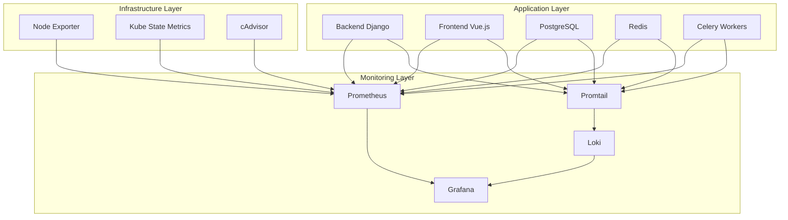

# Monitoring Setup Documentation

## Overview

This document provides comprehensive documentation for the monitoring, logging, and observability stack implemented for the Finch application. The solution includes Prometheus for metrics collection, Loki for log aggregation, and Grafana for visualization and alerting.

## Architecture

### Monitoring Stack Components



## Components

### 1. Prometheus

**Purpose**: Metrics collection and storage
**Location**: `monitoring/prometheus/`

#### Configuration
- **Scrape Interval**: 15 seconds
- **Evaluation Interval**: 15 seconds
- **Retention**: 30 days
- **Storage**: Persistent volume (50Gi)

#### Targets
- **Application Metrics**: Django, Vue.js, Celery
- **Infrastructure Metrics**: Node Exporter, cAdvisor
- **Kubernetes Metrics**: Kube State Metrics

#### Alert Rules
- Application performance (response time, error rate)
- Infrastructure health (CPU, memory, disk)
- Kubernetes cluster status
- Security events
- Business metrics

### 2. Loki

**Purpose**: Log aggregation and storage
**Location**: `monitoring/loki-deployment.yaml`

#### Configuration
- **Retention**: 30 days
- **Storage**: Persistent volume (100Gi)
- **Log Format**: JSON with structured fields

#### Log Sources
- Application logs (Django, Vue.js)
- System logs (Kubernetes, Docker)
- Infrastructure logs (Node, Network)
- Security logs (Authentication, Authorization)

### 3. Grafana

**Purpose**: Visualization and alerting
**Location**: `monitoring/grafana-deployment.yaml`

#### Features
- Real-time dashboards
- Custom alerts with multiple notification channels
- User authentication and authorization
- Data source management

#### Dashboards
1. **Application Overview**: High-level application metrics
2. **Infrastructure Monitoring**: System resource utilization
3. **Kubernetes Cluster**: Kubernetes-specific metrics
4. **Custom Business Metrics**: Application-specific KPIs

### 4. Promtail

**Purpose**: Log shipping agent
**Deployment**: DaemonSet on all nodes

#### Configuration
- Automatically discovers pods with logging annotations
- Parses structured logs
- Adds Kubernetes metadata to logs

## Deployment

### Prerequisites

1. **Kubernetes Cluster**: Running v1.20+
2. **Storage Class**: For persistent volumes
3. **RBAC**: Proper service accounts and permissions
4. **Ingress Controller**: For external access

### Installation Steps

1. **Create Namespace**:
   ```bash
   kubectl apply -f kubernetes/namespace.yaml
   ```

2. **Deploy Prometheus**:
   ```bash
   kubectl apply -f monitoring/prometheus/
   kubectl apply -f monitoring/prometheus-deployment.yaml
   ```

3. **Deploy Loki**:
   ```bash
   kubectl apply -f monitoring/loki-deployment.yaml
   ```

4. **Deploy Grafana**:
   ```bash
   kubectl apply -f monitoring/grafana-deployment.yaml
   ```

### Configuration

#### Prometheus Configuration

The Prometheus configuration includes:

- **Scrape Configs**: For different target types
- **Recording Rules**: For pre-computed metrics
- **Alert Rules**: For proactive monitoring

Key scrape targets:
```yaml
scrape_configs:
  - job_name: 'finch-backend'
    static_configs:
      - targets: ['finch-backend:8000']
  
  - job_name: 'finch-frontend'
    static_configs:
      - targets: ['finch-frontend:80']
  
  - job_name: 'kubernetes-pods'
    kubernetes_sd_configs:
      - role: pod
```

#### Loki Configuration

Loki is configured with:
- **Schema Config**: Time-based partitioning
- **Storage Config**: Object storage backend
- **Limits Config**: Rate limiting and retention

#### Grafana Data Sources

Pre-configured data sources:
1. **Prometheus**: For metrics visualization
2. **Loki**: For log exploration

## Dashboards

### 1. Finch Application Overview

**File**: `monitoring/grafana/dashboards/finch-overview-dashboard.json`

**Panels**:
- Request rate and response time
- Error rate and service status
- Resource utilization (CPU, Memory)
- Application-specific metrics

**Use Cases**:
- Daily operational monitoring
- Performance trend analysis
- Quick health checks

### 2. Infrastructure Monitoring

**File**: `monitoring/grafana/dashboards/infrastructure-dashboard.json`

**Panels**:
- System resource utilization
- Network and disk I/O
- Node status and availability
- Hardware metrics

**Use Cases**:
- Capacity planning
- Performance optimization
- Hardware troubleshooting

### 3. Kubernetes Cluster Monitoring

**File**: `monitoring/grafana/dashboards/kubernetes-dashboard.json`

**Panels**:
- Pod and node status
- Resource requests and limits
- Deployment health
- Cluster events

**Use Cases**:
- Kubernetes operations
- Cluster capacity management
- Troubleshooting pod issues

## Alerting

### Alert Categories

1. **Critical Alerts** (Immediate Action Required)
   - Service down
   - High error rate (>5%)
   - Resource exhaustion (>90%)

2. **Warning Alerts** (Investigation Recommended)
   - Performance degradation
   - Resource pressure (>80%)
   - Unusual patterns

3. **Info Alerts** (Awareness Only)
   - Deployment events
   - Scaling activities
   - Maintenance notifications

### Notification Channels

- **Slack**: For team notifications
- **Email**: For management alerts
- **PagerDuty**: For critical incidents
- **Webhook**: For integration with other tools

## Metrics Collection

### Application Metrics

#### Django Backend
- **Request Metrics**: Rate, duration, status codes
- **Database Metrics**: Query time, connection pool
- **Cache Metrics**: Hit rate, memory usage
- **Custom Metrics**: Business KPIs

#### Vue.js Frontend
- **Performance Metrics**: Page load time, bundle size
- **User Metrics**: Active users, page views
- **Error Metrics**: JavaScript errors, failed requests

#### Celery Workers
- **Task Metrics**: Queue length, processing time
- **Worker Metrics**: Active workers, memory usage
- **Performance Metrics**: Task success/failure rates

### Infrastructure Metrics

#### System Metrics
- **CPU**: Usage, load average, context switches
- **Memory**: Usage, available, swap
- **Disk**: Usage, I/O operations, free space
- **Network**: Throughput, errors, packet loss

#### Kubernetes Metrics
- **Cluster**: Node status, resource allocation
- **Pods**: Status, restarts, resource usage
- **Services**: Endpoint availability, traffic

## Log Management

### Log Structure

All logs follow a structured JSON format:
```json
{
  "timestamp": "2024-01-15T10:30:00Z",
  "level": "INFO",
  "service": "finch-backend",
  "message": "Request processed successfully",
  "request_id": "req-123456",
  "user_id": "user-789",
  "duration_ms": 150,
  "status_code": 200
}
```

### Log Levels

- **ERROR**: System errors, exceptions
- **WARN**: Non-critical issues, deprecations
- **INFO**: General operational messages
- **DEBUG**: Detailed diagnostic information

### Log Retention

- **Application Logs**: 30 days
- **System Logs**: 14 days
- **Security Logs**: 90 days
- **Audit Logs**: 1 year

## Security Considerations

### Access Control

- **Grafana**: RBAC with team-based permissions
- **Prometheus**: Network policies for access restriction
- **Loki**: Query-based access control

### Data Protection

- **Encryption**: TLS for all communications
- **Secrets**: Kubernetes secrets for sensitive data
- **Anonymization**: PII removal from logs

### Compliance

- **GDPR**: Data retention and deletion policies
- **SOC 2**: Audit trail and access logging
- **HIPAA**: Enhanced security controls (if applicable)

## Performance Optimization

### Prometheus

- **Recording Rules**: Pre-compute expensive queries
- **Federation**: Hierarchical Prometheus setup
- **Remote Storage**: Long-term metric storage

### Loki

- **Log Parsing**: Efficient label extraction
- **Compression**: Reduce storage requirements
- **Querying**: Optimize LogQL queries

### Grafana

- **Dashboard Optimization**: Efficient panel queries
- **Caching**: Query result caching
- **Variables**: Template variables for flexibility

## Troubleshooting

### Common Issues

1. **High Memory Usage**
   - Check Prometheus retention settings
   - Review cardinality of metrics
   - Optimize recording rules

2. **Slow Queries**
   - Use recording rules for complex queries
   - Optimize PromQL expressions
   - Check Grafana query settings

3. **Missing Metrics**
   - Verify scrape target configuration
   - Check network connectivity
   - Review service discovery settings

### Diagnostic Commands

```bash
# Check Prometheus targets
kubectl port-forward svc/prometheus 9090:9090
# Visit http://localhost:9090/targets

# Check Grafana health
kubectl logs -f deployment/grafana

# Verify Loki ingestion
kubectl logs -f daemonset/promtail
```

## Maintenance

### Regular Tasks

1. **Daily**
   - Review critical alerts
   - Check dashboard availability
   - Monitor resource usage

2. **Weekly**
   - Update alert thresholds
   - Review dashboard performance
   - Clean up test data

3. **Monthly**
   - Update monitoring stack
   - Review retention policies
   - Capacity planning review

### Backup Strategy

- **Prometheus Data**: Automated snapshots
- **Grafana Dashboards**: Version control
- **Configuration**: Git repository backup

## Best Practices

### Monitoring

1. **SLI/SLO Definition**: Define clear service level indicators
2. **Alert Fatigue**: Minimize false positives
3. **Documentation**: Keep runbooks updated
4. **Testing**: Regularly test alert mechanisms

### Performance

1. **Query Optimization**: Use efficient PromQL queries
2. **Data Retention**: Balance storage and performance
3. **Resource Allocation**: Right-size monitoring components
4. **Network Efficiency**: Minimize scrape intervals

### Security

1. **Access Control**: Implement least privilege
2. **Data Sanitization**: Remove sensitive information
3. **Audit Trails**: Log all administrative actions
4. **Regular Updates**: Keep components up to date

## Integration

### CI/CD Pipeline

- **Automated Testing**: Monitor deployment metrics
- **Quality Gates**: Performance and error rate thresholds
- **Rollback Triggers**: Automatic rollback on failures

### External Tools

- **SIEM**: Security event correlation
- **ITSM**: Incident management integration
- **APM**: Application performance monitoring
- **Cost Management**: Cloud resource optimization

## Support and Documentation

### Resources

- **Prometheus Documentation**: https://prometheus.io/docs/
- **Grafana Documentation**: https://grafana.com/docs/
- **Loki Documentation**: https://grafana.com/docs/loki/
- **Kubernetes Monitoring**: https://kubernetes.io/docs/tasks/debug-application-cluster/

### Training

- **Grafana Fundamentals**: Dashboard creation and management
- **PromQL**: Query language for Prometheus
- **Alert Management**: Effective alerting strategies
- **Troubleshooting**: Common issues and solutions

This monitoring setup provides comprehensive observability for the Finch application, enabling proactive monitoring, quick issue resolution, and data-driven decision making.
