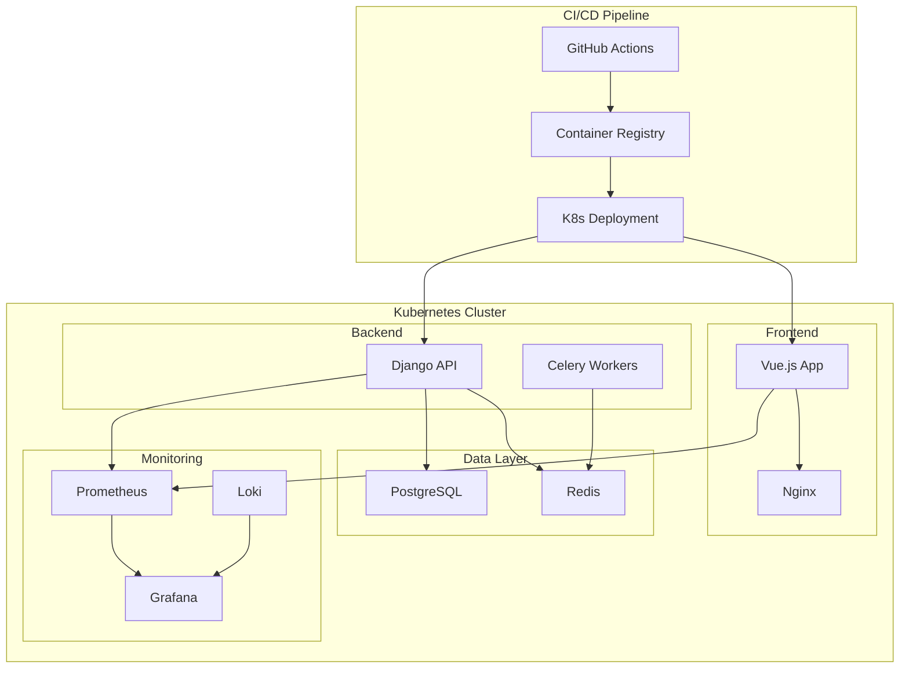

# Finch Application - Complete CI/CD, Containerization & Kubernetes Deployment

## Project Overview

This repository contains a comprehensive, production-grade end-to-end CI/CD, containerization, and Kubernetes deployment solution for the Finch application, which consists of:

- **Frontend**: Vue.js application
- **Backend**: Django REST API
- **Database**: PostgreSQL
- **Cache**: Redis
- **Task Queue**: Celery
- **Monitoring**: Prometheus, Loki, Grafana

## Architecture



## Related Repositories

- **Frontend Application**: [finch-frontend](https://github.com/iamyusuf/finch-frontend)
- **Backend Application**: [finch-backend](https://github.com/iamyusuf/finch-backend)

## Repository Structure

```
├── finch-frontend/               # Vue.js frontend application
│   ├── .github/workflows/       # Frontend CI/CD pipeline
│   │   └── frontend-ci.yml     # Frontend build, test, deploy
│   ├── src/                     # Source code
│   ├── Dockerfile               # Multi-stage production build
│   ├── .dockerignore           # Docker ignore rules
│   ├── entrypoint.sh           # Runtime configuration script
│   └── package.json            # Dependencies and scripts
│
├── finch-backend/                # Django backend application
│   ├── .github/workflows/       # Backend CI/CD pipeline
│   │   └── backend-ci.yml      # Backend build, test, deploy
│   ├── api/                     # API modules
│   ├── core/                    # Core application logic
│   ├── Dockerfile               # Multi-stage production build
│   ├── .dockerignore           # Docker ignore rules
│   ├── entrypoint.sh           # Runtime configuration script
│   └── requirements.txt        # Python dependencies
│
└── ostad-final/                  # DevOps and deployment configurations
    ├── kubernetes/              # Kubernetes manifests
    │   ├── namespace.yaml       # Namespace definition
    │   ├── persistent-volumes.yaml # Storage definitions
    │   ├── *-deployment.yaml   # Application deployments
    │   ├── ingress.yaml        # Traffic routing
    │   └── secrets/            # Secret management
    │       ├── *.yaml          # Secret definitions
    │       └── manage-secrets.sh # Secret automation script
    │
    ├── monitoring/              # Monitoring stack
    │   ├── prometheus/          # Metrics collection
    │   │   ├── prometheus.yml  # Prometheus configuration
    │   │   └── alert-rules.yml # Alerting rules
    │   ├── grafana/            # Visualization
    │   │   └── dashboards/     # Pre-built dashboards
    │   ├── prometheus-deployment.yaml
    │   ├── loki-deployment.yaml
    │   └── grafana-deployment.yaml
    │
    ├── docker-compose.yml       # Local development environment
    └── Documentation/           # Comprehensive documentation
        ├── CI_CD_Setup.md
        ├── Docker_Containerization.md
        ├── Kubernetes_Architecture.md
        ├── Secret_Management.md
        └── Monitoring_Setup.md
```


### Deployment

1. **Create Namespaces**:
   ```bash
   kubectl apply -f kubernetes/namespace.yaml
   ```

2. **Setup Secrets**:
   ```bash
   cd kubernetes/secrets
   chmod +x manage-secrets.sh
   ./manage-secrets.sh generate
   ./manage-secrets.sh apply
   ```

3. **Deploy Storage**:
   ```bash
   kubectl apply -f kubernetes/persistent-volumes.yaml
   kubectl apply -f kubernetes/persistent-volume-claims.yaml
   ```

4. **Deploy Applications**:
   ```bash
   kubectl apply -f kubernetes/postgresql-deployment.yaml
   kubectl apply -f kubernetes/redis-deployment.yaml
   kubectl apply -f kubernetes/backend-deployment.yaml
   kubectl apply -f kubernetes/frontend-deployment.yaml
   kubectl apply -f kubernetes/celery-deployment.yaml
   ```

5. **Setup Networking**:
   ```bash
   kubectl apply -f kubernetes/nginx-config.yaml
   kubectl apply -f kubernetes/ingress.yaml
   ```

6. **Deploy Monitoring**:
   ```bash
   kubectl apply -f monitoring/prometheus-deployment.yaml
   kubectl apply -f monitoring/loki-deployment.yaml
   kubectl apply -f monitoring/grafana-deployment.yaml
   ```


